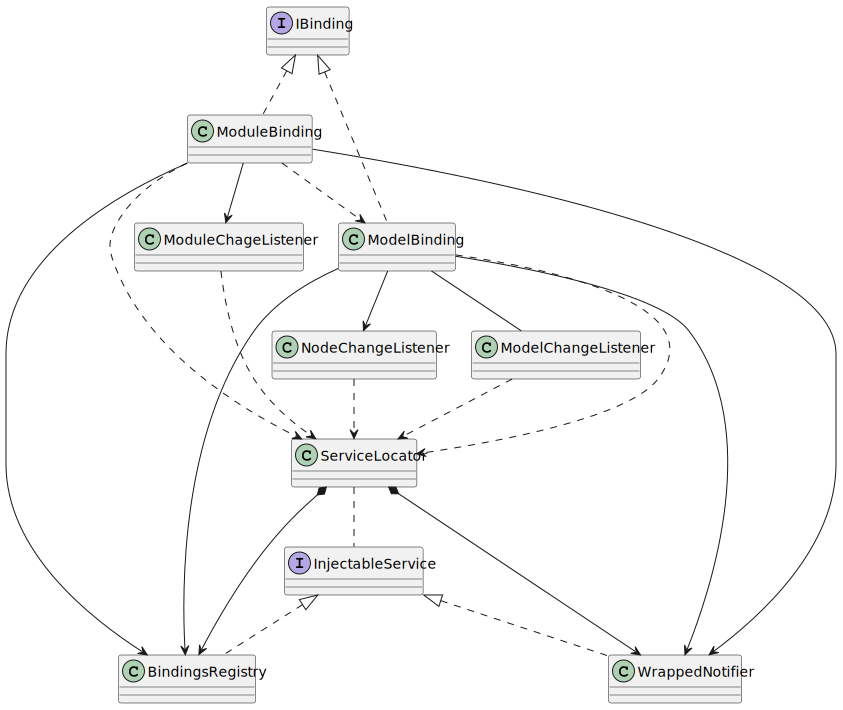

# Binding Activation

The classes and interfaces participating when `IBinding.activate` method is called on the `ModelBinding` and `ModuleBinding` classes.

PlantUML source

<pre>
@startuml
'Entities'
interface "IBinding" as iBinding
class "ModelBinding" as modelBinding
class "ModuleBinding" as moduleBinding

interface "InjectableService" as injectableService
class "ServiceLocator" as serviceLocator
class "WrappedNotifier" as wrappedNotifier
class "BindingsRegistry" as bindingsRegistry

class "NodeChangeListener" as nodeChangeListener
class "ModelChangeListener" as modelChangeListener
class "ModuleChageListener" as moduleChangeListener

'Relations'
iBinding <|.. modelBinding
iBinding <|.. moduleBinding

serviceLocator *--> wrappedNotifier
serviceLocator *--> bindingsRegistry
serviceLocator .. injectableService

injectableService <|.. wrappedNotifier
injectableService <|.. bindingsRegistry

modelBinding ..> serviceLocator
modelBinding --> nodeChangeListener
modelBinding -- modelChangeListener
modelBinding --> wrappedNotifier
modelBinding --> bindingsRegistry

moduleBinding ..> serviceLocator
moduleBinding --> moduleChangeListener
moduleBinding ..> modelBinding
moduleBinding --> wrappedNotifier
moduleBinding --> bindingsRegistry

nodeChangeListener ..> serviceLocator
modelChangeListener ..> serviceLocator
moduleChangeListener ..> serviceLocator

'Notes'

@enduml
</pre>

