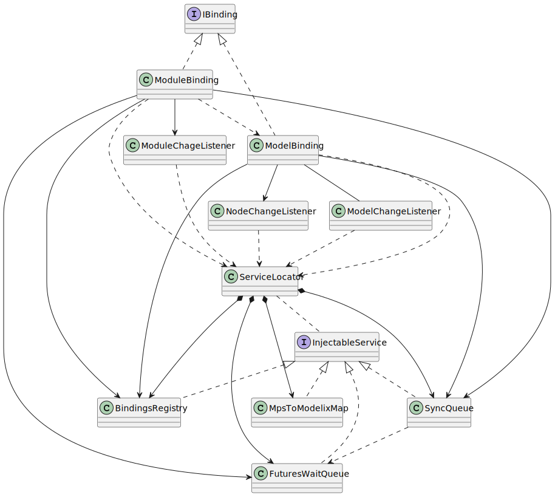

# Binding Deactivation

The classes and interfaces participating when `IBinding.deactivate` method is called on the `ModelBinding` and `ModuleBinding` classes.

Note that the `WrappedNotifier` class is omitted from the figure, because it is used by almost all classes and therefore would make the figure cluttered by a lot of arrows.

PlantUML source

<pre>
@startuml
'Entities'
interface IBinding {
+{abstract} deactivate(removeFromServer: Boolean, callback: Runnable? = null): CompletableFuture<Any?>
}
class "ModelBinding" as modelBinding
class "ModuleBinding" as moduleBinding

interface "InjectableService" as injectableService
class "ServiceLocator" as serviceLocator
class "BindingsRegistry" as bindingsRegistry
class "SyncQueue" as syncQueue
class "MpsToModelixMap" as nodeMap
class "FuturesWaitQueue" as futuresWaitQueue

class "NodeChangeListener" as nodeChangeListener
class "ModelChangeListener" as modelChangeListener
class "ModuleChageListener" as moduleChangeListener

'Relations'
IBinding <|.. modelBinding
IBinding <|.. moduleBinding

serviceLocator *--> bindingsRegistry
serviceLocator *--> syncQueue
serviceLocator *--> nodeMap
serviceLocator *--> futuresWaitQueue
serviceLocator .. injectableService

injectableService <|.. bindingsRegistry
injectableService <|.. syncQueue
injectableService <|.. nodeMap
injectableService <|.. futuresWaitQueue

modelBinding ..> serviceLocator
modelBinding --> nodeChangeListener
modelBinding -- modelChangeListener
modelBinding --> bindingsRegistry
modelBinding --> syncQueue

moduleBinding ..> serviceLocator
moduleBinding --> moduleChangeListener
moduleBinding ..> modelBinding
moduleBinding --> bindingsRegistry
moduleBinding --> syncQueue
moduleBinding --> futuresWaitQueue

nodeChangeListener ..> serviceLocator
modelChangeListener ..> serviceLocator
moduleChangeListener ..> serviceLocator

syncQueue ..> futuresWaitQueue

'Notes'
note right of IBinding: start:\ndeactivate(...): CompletableFuture<Any?>

@enduml
</pre>

