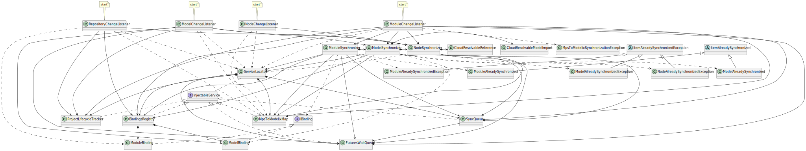

# MPS to modelix Initial Synchronization

The classes and interfaces participating in the modelix to change notifcation. I.e., when a change in MPS happens, then it has to be played into the Model Server. The process begins when MPS calls one of its event callback methods in the `RepositoryChangeListener`, `ModuleChangeListener`, `ModelChangeListener`, `NodeChangeListener` classes.

Note that the `WrappedNotifier` class is omitted from the figure, because it is used by almost all classes and therefore would make the figure cluttered by a lot of arrows.

PlantUML source

<pre>
@startuml
'Entities'
class "RepositoryChangeListener" as repositoryChangeListener
class "ModuleChangeListener" as moduleChangeListener
class "ModelChangeListener" as modelChangeListener
class "NodeChangeListener" as nodeChangeListener

interface "IBinding" as iBinding
class "ModelBinding" as modelBinding
class "ModuleBinding" as moduleBinding

interface "InjectableService" as injectableService
class "ServiceLocator" as serviceLocator
class "BindingsRegistry" as bindingsRegistry
class "SyncQueue" as syncQueue
class "FuturesWaitQueue" as futuresWaitQueue
class "MpsToModelixMap" as nodeMap

class "ModuleSynchronizer" as moduleSynchronizer
class "ModelSynchronizer" as modelSynchronizer
class "NodeSynchronizer" as nodeSynchronizer

class "CloudResolvableModelImport" as cloudResolvableModelImport
class "CloudResolvableReference" as cloudResolvableReference

abstract class "ItemAlreadySynchronized" as itemAlreadySynchronized
class "ModelAlreadySynchronized" as modelAlreadySynchronized
class "ModuleAlreadySynchronized" as moduleAlreadySynchronized

abstract class "ItemAlreadySynchronizedException" as itemAlreadySynchronizedException
class "ModelAlreadySynchronizedException" as modelAlreadySynchronizedException
class "ModuleAlreadySynchronizedException" as moduleAlreadySynchronizedException
class "NodeAlreadySynchronizedException" as nodeAlreadySynchronizedException

class "ProjectLifecycleTracker" as projectLifecycleTracker

class "MpsToModelixSynchronizationException" as mpsToModelixSynchronizationException

'Relations'
injectableService <|.. bindingsRegistry
injectableService <|.. syncQueue
injectableService <|.. futuresWaitQueue
injectableService <|.. nodeMap
injectableService <|.. projectLifecycleTracker

iBinding <|.. modelBinding
iBinding <|.. moduleBinding

serviceLocator *--> bindingsRegistry
serviceLocator *--> syncQueue
serviceLocator *--> futuresWaitQueue
serviceLocator *--> nodeMap
serviceLocator *--> projectLifecycleTracker
serviceLocator .. injectableService

bindingsRegistry *--> modelBinding
bindingsRegistry *--> moduleBinding

itemAlreadySynchronized <|-- modelAlreadySynchronized
itemAlreadySynchronized <|-- moduleAlreadySynchronized

itemAlreadySynchronizedException <|-- modelAlreadySynchronizedException
itemAlreadySynchronizedException <|-- moduleAlreadySynchronizedException
itemAlreadySynchronizedException <|-- nodeAlreadySynchronizedException

moduleSynchronizer --> serviceLocator
moduleSynchronizer *-> modelSynchronizer
moduleSynchronizer --> syncQueue
moduleSynchronizer --> futuresWaitQueue
moduleSynchronizer --> bindingsRegistry
moduleSynchronizer --> nodeMap
moduleSynchronizer ..> iBinding
moduleSynchronizer ..> moduleAlreadySynchronized
moduleSynchronizer ..> moduleAlreadySynchronizedException

modelSynchronizer *-> nodeSynchronizer
modelSynchronizer --> serviceLocator
modelSynchronizer --> syncQueue
modelSynchronizer --> futuresWaitQueue
modelSynchronizer --> bindingsRegistry
modelSynchronizer --> nodeMap
modelSynchronizer ..> modelBinding
modelSynchronizer *-> cloudResolvableModelImport
modelSynchronizer ..> modelAlreadySynchronized
modelSynchronizer ..> modelAlreadySynchronizedException

nodeSynchronizer ..> serviceLocator
nodeSynchronizer --> syncQueue
nodeSynchronizer --> nodeMap
nodeSynchronizer *-> cloudResolvableReference
nodeSynchronizer ..> nodeAlreadySynchronizedException

syncQueue --> futuresWaitQueue

repositoryChangeListener ..> serviceLocator
repositoryChangeListener --> projectLifecycleTracker
repositoryChangeListener --> bindingsRegistry
repositoryChangeListener --> nodeSynchronizer
repositoryChangeListener ..> moduleBinding
repositoryChangeListener ..> nodeMap

moduleChangeListener ..> serviceLocator
moduleChangeListener --> nodeMap
moduleChangeListener --> syncQueue
moduleChangeListener --> futuresWaitQueue
moduleChangeListener --> bindingsRegistry
moduleChangeListener --> projectLifecycleTracker
moduleChangeListener --> moduleSynchronizer
moduleChangeListener --> modelSynchronizer
moduleChangeListener --> nodeSynchronizer
moduleChangeListener ..> mpsToModelixSynchronizationException

modelChangeListener ..> serviceLocator
modelChangeListener --> modelBinding
modelChangeListener ..> nodeMap
modelChangeListener --> futuresWaitQueue
modelChangeListener --> projectLifecycleTracker
modelChangeListener --> modelSynchronizer
modelChangeListener --> nodeSynchronizer

nodeChangeListener ..> serviceLocator
nodeChangeListener --> nodeSynchronizer
nodeChangeListener ..> nodeMap

'Notes'
note top of repositoryChangeListener: start
note top of moduleChangeListener: start
note top of modelChangeListener: start
note top of nodeChangeListener: start

@enduml
</pre>

