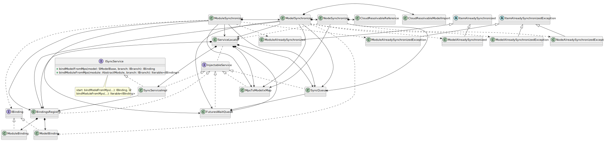

# MPS to modelix Initial Synchronization

The classes and interfaces participating in the modelix to MPS initial synchronization, i.e. when we synchronize Modules and Models from MPS to the Model Server. The process begins when the user calls the `ISyncService.bindModelFromMps` or `ISyncService.bindModuleFromMps` methods.

Note that the `WrappedNotifier` class is omitted from the figure, because it is used by almost all classes and therefore would make the figure cluttered by a lot of arrows.

PlantUML source

<pre>
@startuml
'Entities'
interface ISyncService {
+{abstract} bindModelFromMps(model: SModelBase, branch: IBranch): IBinding
+{abstract} bindModuleFromMps(module: AbstractModule, branch: IBranch): Iterable<IBinding>
}
class "SyncServiceImpl" as syncServiceImpl

interface "IBinding" as iBinding
class "ModelBinding" as modelBinding
class "ModuleBinding" as moduleBinding

interface "InjectableService" as injectableService
class "ServiceLocator" as serviceLocator
class "BindingsRegistry" as bindingsRegistry
class "SyncQueue" as syncQueue
class "FuturesWaitQueue" as futuresWaitQueue
class "MpsToModelixMap" as nodeMap

class "ModuleSynchronizer" as moduleSynchronizer
class "ModelSynchronizer" as modelSynchronizer
class "NodeSynchronizer" as nodeSynchronizer

class "CloudResolvableModelImport" as cloudResolvableModelImport
class "CloudResolvableReference" as cloudResolvableReference

abstract class "ItemAlreadySynchronized" as itemAlreadySynchronized
class "ModelAlreadySynchronized" as modelAlreadySynchronized
class "ModuleAlreadySynchronized" as moduleAlreadySynchronized

abstract class "ItemAlreadySynchronizedException" as itemAlreadySynchronizedException
class "ModelAlreadySynchronizedException" as modelAlreadySynchronizedException
class "ModuleAlreadySynchronizedException" as moduleAlreadySynchronizedException
class "NodeAlreadySynchronizedException" as nodeAlreadySynchronizedException

'Relations'
ISyncService <|.. syncServiceImpl
injectableService <|.. syncServiceImpl
injectableService <|.. bindingsRegistry
injectableService <|.. syncQueue
injectableService <|.. futuresWaitQueue
injectableService <|.. nodeMap

iBinding <|.. modelBinding
iBinding <|.. moduleBinding

serviceLocator *--> syncServiceImpl
serviceLocator *--> bindingsRegistry
serviceLocator *--> syncQueue
serviceLocator *--> futuresWaitQueue
serviceLocator *--> nodeMap
serviceLocator .. injectableService

syncServiceImpl --> bindingsRegistry
syncServiceImpl ..> moduleSynchronizer
syncServiceImpl ..> modelSynchronizer

bindingsRegistry *--> modelBinding
bindingsRegistry *--> moduleBinding

itemAlreadySynchronized <|-- modelAlreadySynchronized
itemAlreadySynchronized <|-- moduleAlreadySynchronized

itemAlreadySynchronizedException <|-- modelAlreadySynchronizedException
itemAlreadySynchronizedException <|-- moduleAlreadySynchronizedException
itemAlreadySynchronizedException <|-- nodeAlreadySynchronizedException

moduleSynchronizer --> serviceLocator
moduleSynchronizer *-> modelSynchronizer
moduleSynchronizer --> syncQueue
moduleSynchronizer --> futuresWaitQueue
moduleSynchronizer --> bindingsRegistry
moduleSynchronizer --> nodeMap
moduleSynchronizer ..> iBinding
moduleSynchronizer ..> moduleAlreadySynchronized
moduleSynchronizer ..> moduleAlreadySynchronizedException

modelSynchronizer *-> nodeSynchronizer
modelSynchronizer --> serviceLocator
modelSynchronizer --> syncQueue
modelSynchronizer --> futuresWaitQueue
modelSynchronizer --> bindingsRegistry
modelSynchronizer --> nodeMap
modelSynchronizer ..> modelBinding
modelSynchronizer *-> cloudResolvableModelImport
modelSynchronizer ..> modelAlreadySynchronized
modelSynchronizer ..> modelAlreadySynchronizedException

nodeSynchronizer ..> serviceLocator
nodeSynchronizer --> syncQueue
nodeSynchronizer --> nodeMap
nodeSynchronizer *-> cloudResolvableReference
nodeSynchronizer ..> nodeAlreadySynchronizedException

syncQueue --> futuresWaitQueue

'Notes'
note bottom of ISyncService: start: bindModelFromMps(...): IBinding, or\nbindModuleFromMps(...): Iterable<IBinding>

@enduml
</pre>

