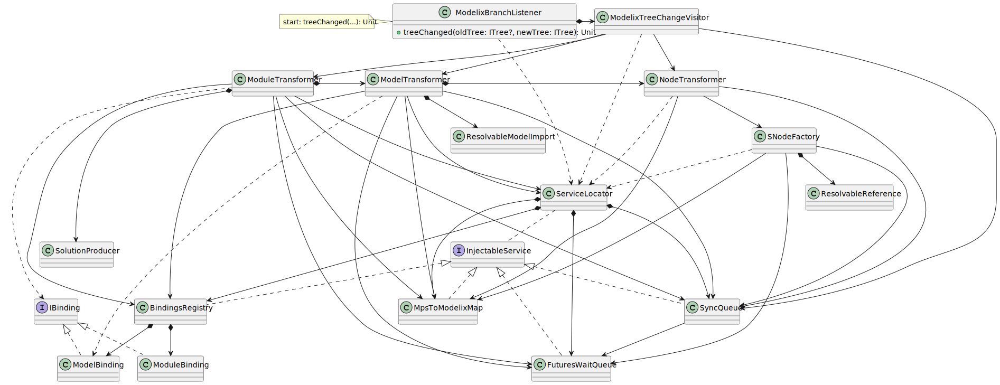

# Modelix to MPS Change Notification

The classes and interfaces participating in the modelix to MPS change notification. I.e., when a server-side change happens then this change has to be played into MPS. The process begins when modelix calls the `ModelixBranchListener.treeChanged` method.

Note that the `WrappedNotifier` class is omitted from the figure, because it is used by almost all classes and therefore would make the figure cluttered by a lot of arrows.

PlantUML source

<pre>
@startuml
'Entities'
class ModelixBranchListener {
+ treeChanged(oldTree: ITree?, newTree: ITree): Unit
}

class "ModelixTreeChangeVisitor" as modelixTreeChangeVisitor

interface "IBinding" as iBinding
class "ModelBinding" as modelBinding
class "ModuleBinding" as moduleBinding

interface "InjectableService" as injectableService
class "ServiceLocator" as serviceLocator
class "BindingsRegistry" as bindingsRegistry
class "SyncQueue" as syncQueue
class "FuturesWaitQueue" as futuresWaitQueue
class "MpsToModelixMap" as nodeMap

class "ModuleTransformer" as moduleTransformer
class "ModelTransformer" as modelTransformer
class "NodeTransformer" as nodeTransformer

class "SolutionProducer" as solutionProducer
class "SNodeFactory" as sNodeFactory

class "ResolvableModelImport" as resolvableModelImport
class "ResolvableReference" as resolvableReference

'Relations'
injectableService <|.. bindingsRegistry
injectableService <|.. syncQueue
injectableService <|.. futuresWaitQueue
injectableService <|.. nodeMap

serviceLocator *--> bindingsRegistry
serviceLocator *--> syncQueue
serviceLocator *--> futuresWaitQueue
serviceLocator *--> nodeMap
serviceLocator .. injectableService

iBinding <|.. modelBinding
iBinding <|.. moduleBinding

bindingsRegistry *--> modelBinding
bindingsRegistry *--> moduleBinding

moduleTransformer --> serviceLocator
moduleTransformer --> bindingsRegistry
moduleTransformer *-> modelTransformer
moduleTransformer --> syncQueue
moduleTransformer --> futuresWaitQueue
moduleTransformer --> nodeMap
moduleTransformer *----> solutionProducer
moduleTransformer ..> iBinding

modelTransformer *-> nodeTransformer
modelTransformer --> bindingsRegistry
modelTransformer --> serviceLocator
modelTransformer --> syncQueue
modelTransformer --> futuresWaitQueue
modelTransformer --> nodeMap
modelTransformer ..> modelBinding
modelTransformer *--> resolvableModelImport

nodeTransformer ..> serviceLocator
nodeTransformer --> syncQueue
nodeTransformer --> nodeMap
nodeTransformer --> sNodeFactory

sNodeFactory ..> serviceLocator
sNodeFactory --> syncQueue
sNodeFactory --> futuresWaitQueue
sNodeFactory *--> resolvableReference
sNodeFactory --> nodeMap

syncQueue --> futuresWaitQueue

ModelixBranchListener ..> serviceLocator
ModelixBranchListener *-> modelixTreeChangeVisitor

modelixTreeChangeVisitor ..> serviceLocator
modelixTreeChangeVisitor --> syncQueue
modelixTreeChangeVisitor --> nodeTransformer
modelixTreeChangeVisitor --> modelTransformer
modelixTreeChangeVisitor --> moduleTransformer

'Notes'
note left of ModelixBranchListener: start: treeChanged(...): Unit

@enduml
</pre>

