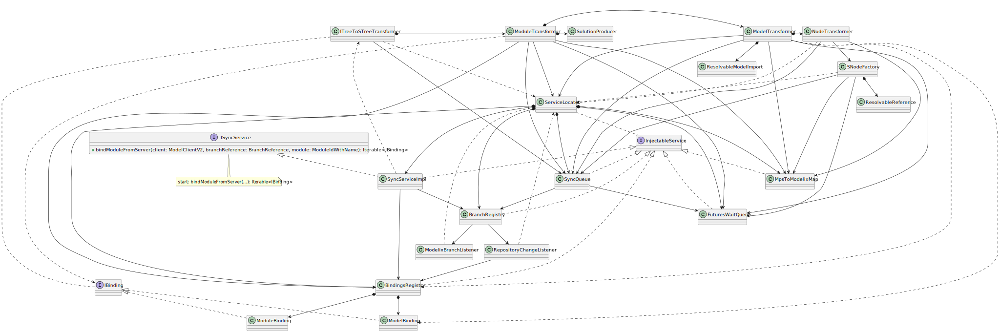

# Modelix to MPS Initial Synchronization

The classes and interfaces participating in the modelix to MPS initial synchronization, i.e. when we synchronize Modules from the model server to MPS. The process begins when the user calls the `ISyncService.bindModuleFromServer` method.

Note that the `WrappedNotifier` class is omitted from the figure, because it is used by almost all classes and therefore would make the figure cluttered by a lot of arrows.

PlantUML source

<pre>
@startuml
'Entities'
interface ISyncService {
+{abstract} bindModuleFromServer(client: ModelClientV2, branchReference: BranchReference, module: ModuleIdWithName): Iterable<IBinding>
}
class "SyncServiceImpl" as syncServiceImpl

interface "IBinding" as iBinding
class "ModelBinding" as modelBinding
class "ModuleBinding" as moduleBinding

interface "InjectableService" as injectableService
class "ServiceLocator" as serviceLocator
class "BindingsRegistry" as bindingsRegistry
class "BranchRegistry" as branchRegistry
class "SyncQueue" as syncQueue
class "FuturesWaitQueue" as futuresWaitQueue
class "MpsToModelixMap" as nodeMap

class "ModelixBranchListener" as modelixBranchListener
class "RepositoryChangeListener" as repositoryChangeListener

class "ITreeToSTreeTransformer" as iTreeToSTreeTransformer
class "ModuleTransformer" as moduleTransformer
class "ModelTransformer" as modelTransformer
class "NodeTransformer" as nodeTransformer

class "SolutionProducer" as solutionProducer
class "SNodeFactory" as sNodeFactory

class "ResolvableModelImport" as resolvableModelImport
class "ResolvableReference" as resolvableReference

'Relations'
ISyncService <|.. syncServiceImpl
injectableService <|.. syncServiceImpl
injectableService <|.. bindingsRegistry
injectableService <|.. branchRegistry
injectableService <|.. syncQueue
injectableService <|.. futuresWaitQueue
injectableService <|.. nodeMap

iBinding <|.. modelBinding
iBinding <|.. moduleBinding

serviceLocator *--> syncServiceImpl
serviceLocator *--> bindingsRegistry
serviceLocator *--> branchRegistry
serviceLocator *--> syncQueue
serviceLocator *--> futuresWaitQueue
serviceLocator *--> nodeMap
serviceLocator .. injectableService

syncServiceImpl --> bindingsRegistry
syncServiceImpl --> branchRegistry
syncServiceImpl ..> iTreeToSTreeTransformer

branchRegistry --> repositoryChangeListener
branchRegistry --> modelixBranchListener

bindingsRegistry *--> modelBinding
bindingsRegistry *--> moduleBinding

repositoryChangeListener ..> serviceLocator
repositoryChangeListener --> bindingsRegistry

modelixBranchListener ..> serviceLocator

iTreeToSTreeTransformer ..> serviceLocator
iTreeToSTreeTransformer *-> moduleTransformer
iTreeToSTreeTransformer --> syncQueue
iTreeToSTreeTransformer .. iBinding

moduleTransformer --> serviceLocator
moduleTransformer *-> modelTransformer
moduleTransformer --> syncQueue
moduleTransformer --> futuresWaitQueue
moduleTransformer --> bindingsRegistry
moduleTransformer --> nodeMap
moduleTransformer *-> solutionProducer
moduleTransformer ..> iBinding

modelTransformer *-> nodeTransformer
modelTransformer --> serviceLocator
modelTransformer --> syncQueue
modelTransformer --> futuresWaitQueue
modelTransformer ..> bindingsRegistry
modelTransformer --> nodeMap
modelTransformer ..> modelBinding
modelTransformer *--> resolvableModelImport

nodeTransformer ..> serviceLocator
nodeTransformer --> syncQueue
nodeTransformer --> nodeMap
nodeTransformer --> sNodeFactory

sNodeFactory ..> serviceLocator
sNodeFactory --> syncQueue
sNodeFactory --> futuresWaitQueue
sNodeFactory *--> resolvableReference
sNodeFactory --> nodeMap

syncQueue --> branchRegistry
syncQueue --> futuresWaitQueue

'Notes'
note bottom of ISyncService: start: bindModuleFromServer(...): Iterable<IBinding>

@enduml
</pre>

