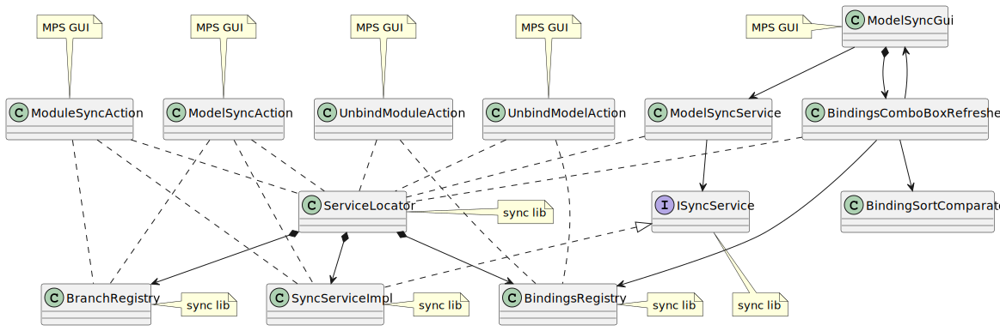

# Plugin GUI and Sync Lib Integration

The classes and interfaces participating in the communication between the plugin's GUI (a simplified form) and the modelix plugin sync lib classes, that coordinate the synchronization between modelix and MPS. Besides, the MPS GUI actions, that are registered in the context menus, are also represented in the figure.

In the figure, classes with direct access from the MPS GUI are labeled as `MPS GUI`, classes and interfaces that are residing in the sync lib, i.e. the `mps-sync-plugin-lib` project, are labeled as `sync lib`.

PlantUML source

<pre>
@startuml
'Entities'
class "ModelSyncGui" as modelSyncGui
class "ModelSyncService" as modelSyncService

interface "ISyncService" as iSyncService
class "SyncServiceImpl" as syncServiceImpl

class "ServiceLocator" as serviceLocator
class "BindingsRegistry" as bindingsRegistry
class "BranchRegistry" as branchRegistry

class "BindingsComboBoxRefresher" as bindingsComboBoxRefresher
class "BindingSortComparator" as bindingsSortComparator

class "ModelSyncAction" as modelSyncAction
class "ModuleSyncAction" as moduleSyncAction
class "UnbindModelAction" as unbindModelAction
class "UnbindModuleAction" as unbindModuleAction

interface "InjectableService" as injectableService

'Relations'
iSyncService <|.. syncServiceImpl
injectableService <|.. syncServiceImpl
injectableService <|.. bindingsRegistry
injectableService <|.. branchRegistry

serviceLocator *--> syncServiceImpl
serviceLocator *--> bindingsRegistry
serviceLocator *--> branchRegistry
serviceLocator .. injectableService

syncServiceImpl --> branchRegistry
syncServiceImpl --> bindingsRegistry

modelSyncGui --> modelSyncService
modelSyncService ..> serviceLocator
modelSyncService --> iSyncService

modelSyncGui *--> bindingsComboBoxRefresher
bindingsComboBoxRefresher --> modelSyncGui
bindingsComboBoxRefresher ..> serviceLocator
bindingsComboBoxRefresher --> bindingsRegistry
bindingsComboBoxRefresher --> bindingsSortComparator

modelSyncAction ..> serviceLocator
modelSyncAction ..> branchRegistry
modelSyncAction ..> syncServiceImpl

moduleSyncAction ..> serviceLocator
moduleSyncAction ..> branchRegistry
moduleSyncAction ..> syncServiceImpl

unbindModelAction ..> serviceLocator
unbindModelAction ..> bindingsRegistry

unbindModuleAction ..> serviceLocator
unbindModuleAction ..> bindingsRegistry

'Notes'
note right of modelSyncGui: MPS GUI
note top of modelSyncAction: MPS GUI
note top of moduleSyncAction: MPS GUI
note top of unbindModelAction: MPS GUI
note top of unbindModuleAction: MPS GUI

note right of syncServiceImpl: sync lib
note right of serviceLocator: sync lib
note right of branchRegistry: sync lib
note right of bindingsRegistry: sync lib
note top of iSyncService: sync lib
note right of injectableService: sync lib

@enduml
</pre>

