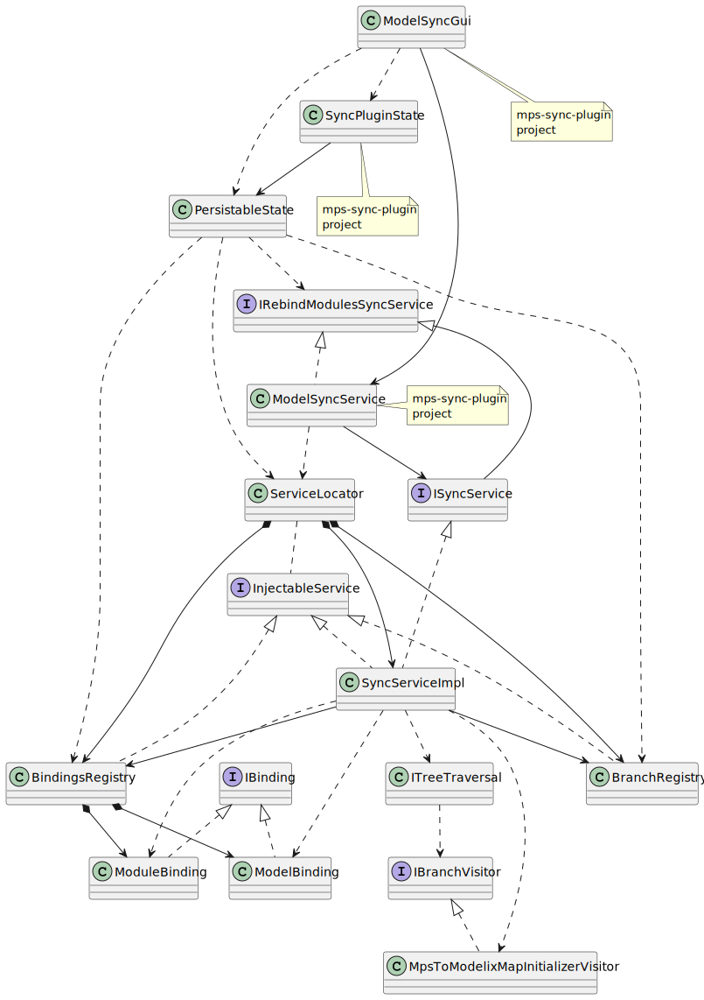

# Plugin State Persistence and Restore

The classes and interfaces participating in persisting and restoring the sync plugin's state. Classes and interfaces without a label are residing in the `mps-sync-plugin-lib` project.

PlantUML source

<pre>
@startuml
'Entities'
class "ModelSyncGui" as modelSyncGui
class "ModelSyncService" as modelSyncService
class "SyncPluginState" as syncPluginState

class "PersistableState" as persistableState

interface "IRebindModulesSyncService" as iRebindModulesSyncService

interface "ISyncService" as iSyncService
class "SyncServiceImpl" as syncServiceImpl

class "ServiceLocator" as serviceLocator
class "BindingsRegistry" as bindingsRegistry
class "BranchRegistry" as branchRegistry

class "ITreeTraversal" as iTreeTraversal
interface "IBranchVisitor" as iBranchVisitor
class "MpsToModelixMapInitializerVisitor" as mpsToModelixMapInitializerVisitor

interface "IBinding" as iBinding
class "ModelBinding" as modelBinding
class "ModuleBinding" as moduleBinding

interface "InjectableService" as injectableService

'Relations'
modelSyncGui --> modelSyncService
modelSyncGui ..> syncPluginState
modelSyncGui ..> persistableState

syncPluginState --> persistableState

iRebindModulesSyncService <|-- iSyncService
iRebindModulesSyncService <|.. modelSyncService
modelSyncService ..> serviceLocator
modelSyncService --> iSyncService

serviceLocator *--> syncServiceImpl
serviceLocator *--> bindingsRegistry
serviceLocator *--> branchRegistry
serviceLocator .. injectableService

iSyncService <|.. syncServiceImpl
syncServiceImpl --> branchRegistry
syncServiceImpl --> bindingsRegistry
syncServiceImpl ..> iTreeTraversal
syncServiceImpl ..> mpsToModelixMapInitializerVisitor
syncServiceImpl ..> modelBinding
syncServiceImpl ..> moduleBinding

injectableService <|.. syncServiceImpl
injectableService <|.. bindingsRegistry
injectableService <|.. branchRegistry

persistableState ..> iRebindModulesSyncService
persistableState ..> serviceLocator
persistableState ..> branchRegistry
persistableState ..> bindingsRegistry

iTreeTraversal ..> iBranchVisitor
iBranchVisitor <|.. mpsToModelixMapInitializerVisitor

iBinding <|.. modelBinding
iBinding <|.. moduleBinding

bindingsRegistry *--> modelBinding
bindingsRegistry *--> moduleBinding

'Notes'
note bottom of modelSyncGui: mps-sync-plugin\nproject
note bottom of syncPluginState: mps-sync-plugin\nproject
note right of modelSyncService: mps-sync-plugin\nproject

@enduml
</pre>

