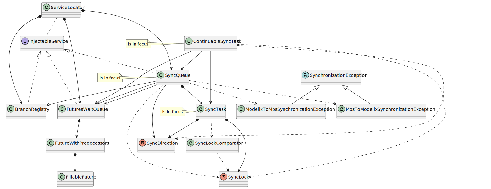

# SyncQueue, SyncTask, ContinuableSyncTask

The classes and interfaces participating in the asynchronous parallel execution of various synchronization tasks in general. We focus on the `SyncQueue`, `SyncTask`, `ContinuableSyncTask` classes, as the main concepts in the task execution workflow, but the other, closely related classes are also represented.

Note that the `WrappedNotifier` class is omitted from the figure, because it is used by almost all classes and therefore would make the figure cluttered by a lot of arrows.

PlantUML source

<pre>
@startuml
'Entities'
interface "InjectableService" as injectableService
class "ServiceLocator" as serviceLocator
class "SyncQueue" as syncQueue
class "FuturesWaitQueue" as futuresWaitQueue
class "BranchRegistry" as branchRegistry

class "SyncTask" as syncTask
class "ContinuableSyncTask" as continuableSyncTask

enum "SyncDirection" as syncDirection
enum "SyncLock" as syncLock
class "SyncLockComparator" as syncLockComparator

abstract class "SynchronizationException" as synchronizationException
class "MpsToModelixSynchronizationException" as mpsToModelixSynchronizationException
class "ModelixToMpsSynchronizationException" as modelixToMpsSynchronizationException

class "FutureWithPredecessors" as futureWithPredecessors
class "FillableFuture" as fillableFuture

'Relations'
injectableService <|.. syncQueue
injectableService <|.. futuresWaitQueue
injectableService <|.. branchRegistry

synchronizationException <|-- mpsToModelixSynchronizationException
synchronizationException <|-- modelixToMpsSynchronizationException

serviceLocator *--> syncQueue
serviceLocator *--> futuresWaitQueue
serviceLocator *--> branchRegistry
serviceLocator .. injectableService

syncQueue --> futuresWaitQueue
syncQueue --> syncDirection
syncQueue *--> syncTask
syncQueue --> branchRegistry
syncQueue --> futuresWaitQueue
syncQueue ..> syncLock
syncQueue ..> mpsToModelixSynchronizationException
syncQueue ..> modelixToMpsSynchronizationException

syncTask *--> syncLock
syncTask ..> syncLockComparator
syncTask *--> syncDirection

syncLockComparator ..> syncLock

continuableSyncTask --> syncTask
continuableSyncTask --> syncQueue
continuableSyncTask --> futuresWaitQueue
continuableSyncTask ..> syncLock
continuableSyncTask ..> syncDirection

futuresWaitQueue *--> futureWithPredecessors

futureWithPredecessors *--> fillableFuture

'Notes'
note left of syncQueue: is in focus
note left of syncTask: is in focus
note left of continuableSyncTask: is in focus

@enduml
</pre>

